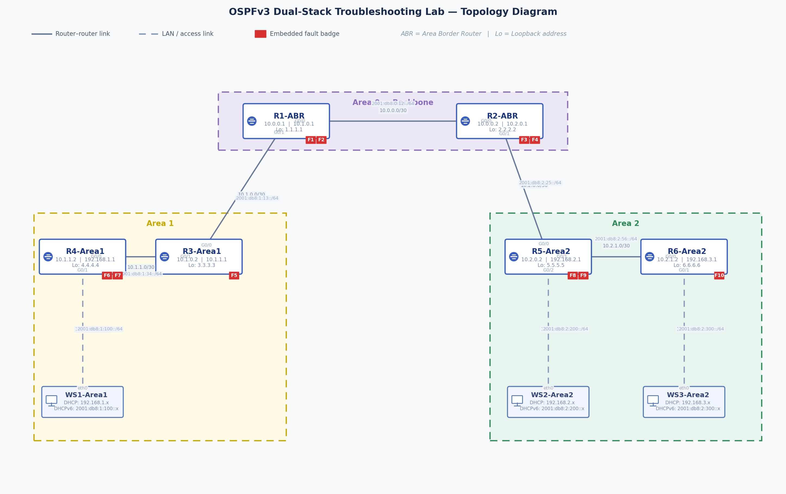

# OSPFv3 Dual-Stack Troubleshooting Lab
### Multi-Area OSPFv2 / OSPFv3 · IPv4 + IPv6 Dual Stack · DHCP · 10 Embedded Faults


---

## Overview

This repository contains a fully functional **Cisco Modeling Labs (CML)** troubleshooting lab built for engineers studying multi-area OSPF, dual-stack networking, and DHCPv4/v6. The topology is pre-loaded with **10 intentional misconfigurations** across 6 routers and 3 workstations — each fault is documented in the companion lab guide with symptoms, root cause analysis, verification steps, and exact fix commands.

Whether you are working toward your **CCNP/CCIE**, onboarding to a new team, or just keeping your skills sharp — this lab gets you into a realistic, complex troubleshooting scenario in minutes.

> **Built with AI assistance** — the entire lab (topology, node configs, wiring, fault injection, topology diagram, and lab document) was generated using Claude via the CML API, demonstrating how AI can dramatically accelerate lab creation and study workflows.

---

## Topology



| Area | Nodes | IPv4 Subnets | IPv6 Prefixes |
|------|-------|-------------|---------------|
| **Area 0** (Backbone) | R1-ABR, R2-ABR | 10.0.0.0/30 | 2001:db8:0::/48 |
| **Area 1** | R3-Area1, R4-Area1, WS1 | 10.1.0.0/30, 10.1.1.0/30, 192.168.1.0/24 | 2001:db8:1::/48 |
| **Area 2** | R5-Area2, R6-Area2, WS2, WS3 | 10.2.0.0/30, 10.2.1.0/30, 192.168.2-3.0/24 | 2001:db8:2::/48 |

---

## Quick Start

### Prerequisites

- Cisco Modeling Labs 2.x or later
- Image definitions available: `iosv-159-3-m10`, `alpine-desktop-3-21-3`
- CML account with lab import permissions

### Import the Lab

1. Download [`lab/OSPFv3_DualStack_TroubleshootingLab.yaml`](lab/OSPFv3_DualStack_TroubleshootingLab.yaml)
2. In the CML UI, go to **Tools → Import Lab**
3. Upload the YAML file
4. Click **Start Lab** — all 9 nodes will boot automatically
5. Open the lab guide [`docs/OSPFv3_DualStack_TroubleshootingLab.docx`](docs/OSPFv3_DualStack_TroubleshootingLab.docx) and begin troubleshooting

> **Note:** The lab is pre-configured with all 10 faults already injected. Do **not** wipe node configs before starting — the faults live in the startup configurations.

---

## The 10 Faults

Attempt to find and fix each fault independently before consulting the solutions appendix in the lab guide.

| # | Node | Fault Type | Protocol |
|---|------|-----------|---------|
| F1 | R1-ABR | OSPFv3 process-ID mismatch on G0/1 (2 vs 1) | OSPFv3 |
| F2 | R1-ABR | `ipv6 unicast-routing` missing globally | IPv6 |
| F3 | R2-ABR | OSPFv3 `router-id` not configured | OSPFv3 |
| F4 | R2-ABR | IPv4 OSPF area mismatch on G0/1 (area 0 vs area 2) | OSPFv2 |
| F5 | R3-Area1 | DHCPv4 excluded range covers entire pool | DHCP |
| F6 | R4-Area1 | LAN interface toward WS1 is `shutdown` | Layer 2 |
| F7 | R4-Area1 | DHCPv6 server not applied + ND managed-flag missing | DHCPv6 |
| F8 | R5-Area2 + R6-Area2 | OSPF hello/dead timer mismatch (10/40 vs 30/120) | OSPFv2/v3 |
| F9 | R5-Area2 | `ip helper-address` points to non-existent host | DHCP Relay |
| F10 | R6-Area2 | `default-information originate always` missing | OSPFv2/v3 |

---

## Lab Success Criteria

The lab is complete when **all** of the following are true:

- [ ] WS1, WS2, and WS3 each receive a valid IPv4 address via DHCP
- [ ] WS1, WS2, and WS3 each receive a valid IPv6 address via DHCPv6 (stateful)
- [ ] WS1 can ping WS2 and WS3 over both IPv4 and IPv6
- [ ] WS2 can ping WS3 over both IPv4 and IPv6
- [ ] All 6 routers show complete OSPFv2 and OSPFv3 routing tables
- [ ] All OSPFv2 and OSPFv3 adjacencies are in **FULL** state
- [ ] No OSPF area boundary violations exist

---

## Repository Structure

```
ospfv3-dualstack-troubleshooting-lab/
│
├── README.md                          ← You are here
│
├── lab/
│   └── OSPFv3_DualStack_TroubleshootingLab.yaml   ← CML import file
│
├── docs/
│   └── OSPFv3_DualStack_TroubleshootingLab.docx   ← Full lab guide + solutions
│
├── topology/
│   └── topology_diagram.png           ← High-res topology diagram
│
├── configs/
│   ├── R1-ABR/
│   │   └── startup-config.txt         ← R1 config (faults F1, F2)
│   ├── R2-ABR/
│   │   └── startup-config.txt         ← R2 config (faults F3, F4)
│   ├── R3-Area1/
│   │   └── startup-config.txt         ← R3 config (fault F5)
│   ├── R4-Area1/
│   │   └── startup-config.txt         ← R4 config (faults F6, F7)
│   ├── R5-Area2/
│   │   └── startup-config.txt         ← R5 config (faults F8, F9)
│   └── R6-Area2/
│       └── startup-config.txt         ← R6 config (fault F10)
│
└── .github/
    └── ISSUE_TEMPLATE.md              ← Template for submitting new fault ideas
```

---

## Addressing Plan

| Node | Interface | IPv4 | IPv6 |
|------|-----------|------|------|
| R1-ABR | Loopback0 | 1.1.1.1/32 | 2001:db8:0:1::1/128 |
| R1-ABR | G0/0 | 10.0.0.1/30 | 2001:db8:0:12::1/64 |
| R1-ABR | G0/1 | 10.1.0.1/30 | 2001:db8:1:13::1/64 |
| R2-ABR | Loopback0 | 2.2.2.2/32 | 2001:db8:0:2::2/128 |
| R2-ABR | G0/0 | 10.0.0.2/30 | 2001:db8:0:12::2/64 |
| R2-ABR | G0/1 | 10.2.0.1/30 | 2001:db8:2:25::1/64 |
| R3-Area1 | Loopback0 | 3.3.3.3/32 | 2001:db8:1:3::3/128 |
| R3-Area1 | G0/0 | 10.1.0.2/30 | 2001:db8:1:13::2/64 |
| R3-Area1 | G0/1 | 10.1.1.1/30 | 2001:db8:1:34::1/64 |
| R4-Area1 | Loopback0 | 4.4.4.4/32 | 2001:db8:1:4::4/128 |
| R4-Area1 | G0/0 | 10.1.1.2/30 | 2001:db8:1:34::2/64 |
| R4-Area1 | G0/1 | 192.168.1.1/24 | 2001:db8:1:100::1/64 |
| R5-Area2 | Loopback0 | 5.5.5.5/32 | 2001:db8:2:5::5/128 |
| R5-Area2 | G0/0 | 10.2.0.2/30 | 2001:db8:2:25::2/64 |
| R5-Area2 | G0/1 | 10.2.1.1/30 | 2001:db8:2:56::1/64 |
| R5-Area2 | G0/2 | 192.168.2.1/24 | 2001:db8:2:200::1/64 |
| R6-Area2 | Loopback0 | 6.6.6.6/32 | 2001:db8:2:6::6/128 |
| R6-Area2 | G0/0 | 10.2.1.2/30 | 2001:db8:2:56::2/64 |
| R6-Area2 | G0/1 | 192.168.3.1/24 | 2001:db8:2:300::1/64 |
| WS1-Area1 | eth0 | DHCP — 192.168.1.x | DHCPv6 — 2001:db8:1:100::x |
| WS2-Area2 | eth0 | DHCP — 192.168.2.x | DHCPv6 — 2001:db8:2:200::x |
| WS3-Area2 | eth0 | DHCP — 192.168.3.x | DHCPv6 — 2001:db8:2:300::x |

---

## Key Troubleshooting Commands

```
! Check adjacencies
show ip ospf neighbor
show ipv6 ospf neighbor

! Verify interface area assignment and timers
show ip ospf interface <intf>
show ipv6 ospf interface <intf>

! Inspect routing tables
show ip route ospf
show ipv6 route ospf

! DHCP diagnostics
show ip dhcp binding
show ipv6 dhcp binding
show ipv6 dhcp interface <intf>

! Real-time DHCP debug
debug ip dhcp server events
```

---

## How This Was Built

This lab was generated end-to-end using **Claude** (Anthropic) connected to the **CML API**, demonstrating an AI-assisted network lab workflow:

1. **Topology design** — described the requirements in natural language (areas, nodes, dual-stack, DHCP, workstations)
2. **Lab creation** — Claude called the CML REST API to create the lab, add all 9 nodes, wire 8 links, and push full startup configs with embedded faults
3. **Documentation** — a full lab guide (Word document) was generated including topology diagram, addressing plan, fault index, troubleshooting workflow, and solutions appendix
4. **Diagram rendering** — a high-resolution topology PNG was rendered in Python (matplotlib) and embedded directly into the Word document
5. **Export** — the lab topology was exported as a portable YAML file for sharing

The entire process — from blank canvas to a running, documented, fault-injected lab — took a single conversation.

---

## Contributing

Found a better fault scenario? Want to add a BGP, EIGRP, or MPLS variant? Contributions are welcome.

1. Fork the repository
2. Create a feature branch: `git checkout -b feat/add-bgp-lab`
3. Add your lab YAML, configs, and updated README section
4. Submit a pull request using the provided template

See [`.github/ISSUE_TEMPLATE.md`](.github/ISSUE_TEMPLATE.md) for how to suggest new fault scenarios.

---

## License

MIT — free to use, share, and adapt for personal study, training programs, or classroom use. Attribution appreciated but not required.

---

## Resources

- [Cisco Modeling Labs Documentation](https://developer.cisco.com/docs/modeling-labs/)
- [IOSv Configuration Guide](https://www.cisco.com/c/en/us/td/docs/routers/ios/configuration/guide/b_ios_configuration_guide.html)
- [OSPFv3 Design Guide — Cisco](https://www.cisco.com/c/en/us/support/docs/ip/open-shortest-path-first-ospf/47868-ospfv3-00.html)
- [Anthropic Claude](https://claude.ai)

---

*Generated with AI assistance using Claude + CML API · April 2026*
